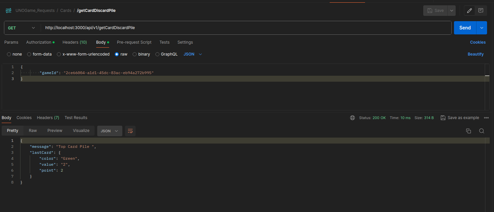

# Cache Memoization Implementation for Specific Function 'Cards'

## Overview
This is a improvement of momoizeMiddleware, because demonstrates the implementation of a cache memoization strategy within the repository layer of an application. The goal is to improve performance by reducing redundant database queries. The cache is used to store the results of frequently called queries, enabling the application to return cached responses for subsequent identical requests, avoiding unnecessary hits to the database.

### Features
- In-Memory Cache: The cache is implemented using JavaScript's built-in Map object for efficient key-value storage.
- LRU Cache Policy: The cache follows a Least Recently Used (LRU) eviction policy, ensuring that the oldest cached items are removed when the cache reaches its maximum capacity.
- Cache Expiration: Cached items have an expiration time, after which they are automatically invalidated.
- Automatic Invalidation: Cache invalidation occurs automatically when data changes (e.g., after create, update, or delete operations) to ensure consistency between the cached data and the database.
- Configurable: Cache size and expiration time can be configured according to the specific needs of the application.


## How It Works
CacheManager Class
The CacheManager class is responsible for managing the cache. It stores query results and handles retrieval, expiration, and eviction based on a configured maximum size and time-to-live (TTL) for each cache entry.


- Cache Key Generation: Cache keys are generated based on the function parameters (e.g., card-findById-${id} or card-findAllByClause-${JSON.stringify(whereClause)}) to uniquely identify each query.
- Cache Management: The CacheManager handles the cache logic, ensuring that the cache size does not exceed the defined limit and that stale entries are removed.
- Automatic Invalidation: Cache is invalidated whenever data-modifying methods (create, update, delete) are called, ensuring that stale data is not served from the cache.

## Configuration
We can configure the cache by adjusting the parameters in the CacheManager constructor:

maxSize: The maximum number of items to store in the cache. When the cache reaches this limit, the least recently used (LRU) item is removed.
maxAge: The maximum age (in milliseconds) for a cached item before it expires and is automatically removed from the cache.


```javascript
this.cacheManager = new CacheManager(100, 60000); // Cache up to 100 items, with a 60-second TTL
```


This function was implemented in the repository of letters, since the data that are stored in the database never change values or actuanlizan or deleted, so before making a find the model is checked if you already have in cache this value, if so does not return if you should not make the query.


## Examples

If we list all cards with endpoint we can see a message indicate, response was get with CACHE e.g.


Console message:


If we get the top card pile for twice we can see the CACHE is used too



Console Message:


If we can see the status game, with all deatils related of it, eg All cards of each user player, if this informacion already do before, Just return this information in order to do a query database.


In the console, we can see that Cache infomartion about cards is using


