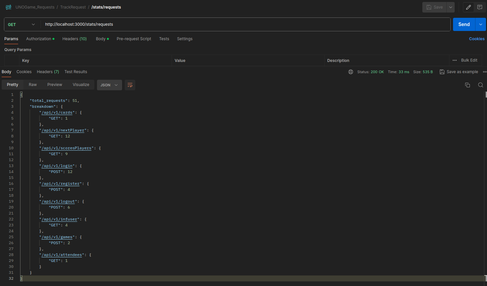
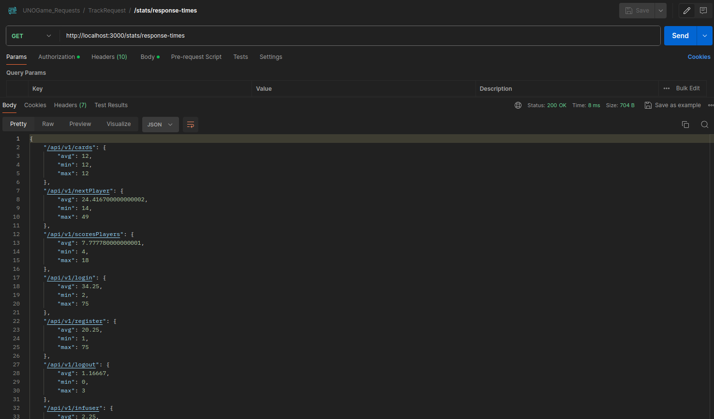
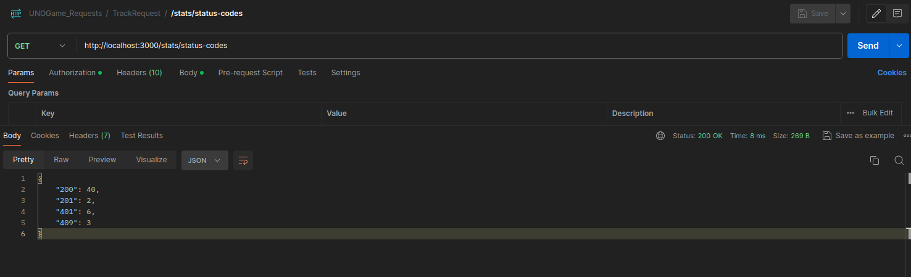
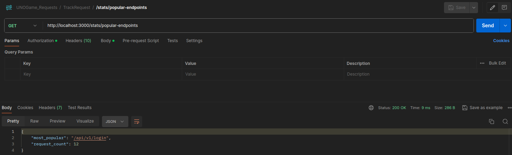

# UNO Card Game API - Request Tracking Middleware and Statistics Endpoints


## Overview
This middleware implements a request tracking middleware to monitor API usage statistics for the UNO card game Capstone project. The middleware logs key performance metrics, such as request count, response times, HTTP methods, and status codes, for each endpoint in the API. Additionally, several endpoints are provided to retrieve aggregated statistics from the tracked data.

## Features
- **Request Tracking Middleware:** Logs request information including endpoint, method, status code, response times, and user details.
- **Aggregated Statistics Endpoints:** Provides various statistics on API usage, including total request counts, response time averages, status code distribution, and popular endpoints.


## Request Tracking Middleware
The requestTracking middleware is a higher-order function that wraps API controllers to collect and store usage statistics in the database. This middleware is applied to the desired API endpoints to track the following data:

- **Endpoint:** The URL of the accessed endpoint.
- **Request Method:** HTTP method used (e.g., GET, POST).
- **Status Code:** The HTTP status code returned (e.g., 200, 404).
- **Response Time:** The time taken to process the request (min, max, and average).
- **Request Count:** The number of times an endpoint was accessed.
- **User ID (optional):** The ID or username of the user making the request (if authentication is implemented).
- **Timestamp:** The date and time of the request.

## Example Data Entry
```json
{
  "endpointAccess": "/api/users",
  "requestMethod": "GET",
  "statusCode": 200,
  "responseTimeAvg": 120,
  "responseTimeMin": 100,
  "responseTimeMax": 140,
  "requestCount": 10,
  "timestamp": "2024-09-02T10:34:56Z",
  "userId": "user123"
}
```

## Usage
To enable request tracking for an endpoint, wrap the corresponding controller with the requestTracking middleware.

```javascript
app.get('/api/users', requestTracking(userController.getUsers));
```

## Aggregated Statistics Endpoints
1. **/stats/requests**

This endpoint returns the total number of requests made to the API, broken down by endpoint and HTTP method.

**Method:** GET

- **Example in Postman:**




2. **/stats/response-times**

This endpoint provides the average, minimum, and maximum response times for each endpoint.

**Method:** GET

- **Example in Postman:**



3. **/stats/status-codes**

This endpoint provides a summary of the HTTP status codes returned by the API, along with counts for each status code.

**Method:** GET

- **Example in Postman:**




3. **/stats/popular-endpoints**

This endpoint lists the most frequently accessed endpoints, along with the total number of requests made to each endpoint.

**Method:** GET

- **Example in Postman:**

