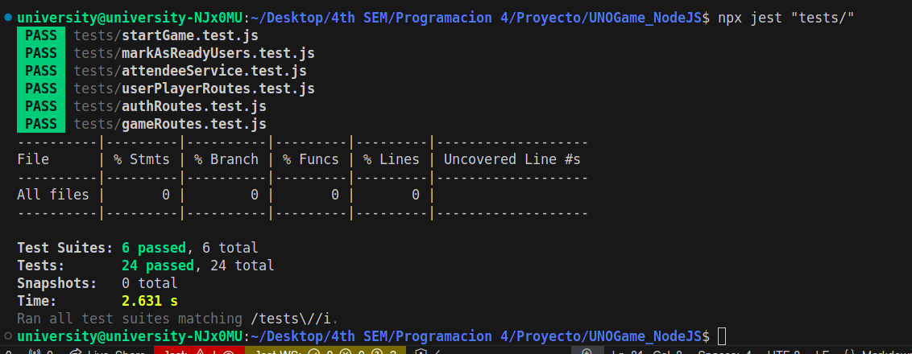

# Project README
## E2E Testing Setup and Execution
### Prerequisites
Before running the end-to-end (E2E) tests, ensure that your server is running locally. Follow these steps to set up and execute the tests:

1. Start the Local Server
Clone the repository to your local machine:

```bash
git clone https://gitlab.com/daynot/p-4-labs
```

Install all required dependencies:

```bash
npm install
```

Start the server:

```bash
npm run start
```
The server should now be running on http://localhost:3000.

2. Run the E2E Tests
Open a new terminal and navigate to the project directory.

Run the following command to execute the tests:

```bash
npm run e2e-test
```

This will execute the end-to-end tests using a testing framework like Jest or Mocha.


## Overview of Key Test Files

1. tests/e2e/startGame.test.js
Description: Tests the flow related to starting a game. It ensures that the game cannot start unless all players are marked as "ready" and that only the creator of the game has the permission to start it.
Endpoints Covered:
POST /api/v1/register: Registers new users.
POST /api/v1/login: Logs in the users to obtain access tokens.
POST /api/v1/games: Creates a new game.
POST /api/v1/attendees: Adds users as attendees to the created game.
POST /api/v1/attendeeReady: Marks attendees as ready.
POST /api/v1/startGame: Attempts to start the game.
Importance: This test ensures that the core functionality of starting a game is executed correctly according to the business rules. It validates user roles and readiness before allowing a game to start, maintaining a controlled gaming environment.

2. tests/e2e/attendeeReady.test.js
Description: Tests the attendeeReady endpoint to verify that users can only mark themselves as "ready" once and checks for valid authentication tokens.
Endpoints Covered:
POST /api/v1/attendeeReady: Marks a user as ready for a game.
Importance: Verifies user readiness status handling, prevents duplicate operations, and ensures proper authentication management, which is critical for game logic and fairness.

3. tests/e2e/registerUser.test.js
Description: Tests the user registration functionality by ensuring that users are created with valid data, and checks for proper error handling when invalid data is provided.
Endpoints Covered:
POST /api/v1/register: Registers new users.
Importance: Guarantees that new users can be registered correctly, which is foundational for any further game interactions or actions.

4. tests/e2e/loginUser.test.js
Description: Verifies that registered users can log in successfully, receive a valid authentication token, and that errors are returned when login credentials are incorrect.
Endpoints Covered:
POST /api/v1/login: Logs in the users.
Importance: Confirms that authentication works as expected, which is crucial for maintaining secure access control across the application.

5. tests/e2e/attendee.test.js
Description: Tests the attendees endpoint to verify that users can successfully register as attendees to a game, and checks the correct handling of errors when attempting to register for a game improperly.
Endpoints Covered:
POST /api/v1/attendees: Adds users as attendees to a game.
Importance: Ensures that users can correctly join a game, which is essential for the overall game flow and player interaction.
Justification for E2E Tests
End-to-end (E2E) testing is crucial for ensuring that the entire application works seamlessly from the user's perspective. By covering all critical user flows and scenarios, such as user registration, login, game creation, and game start processes, we verify that every integrated component functions correctly together. E2E tests simulate real-world use cases, reducing the risk of bugs and issues when the application is deployed to production.

These tests are vital for maintaining a high level of confidence in the application's stability and performance, especially in a dynamic environment where multiple users interact with each other and the system.

Results:

